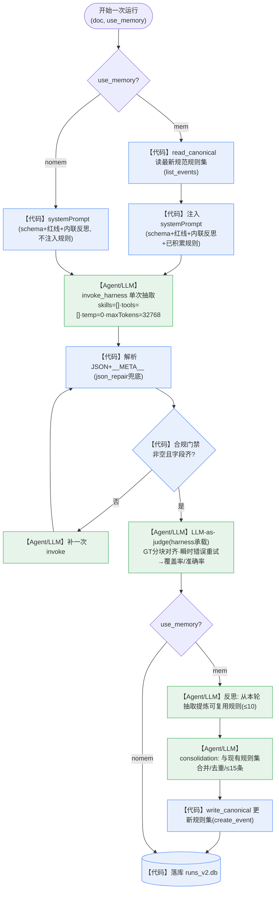
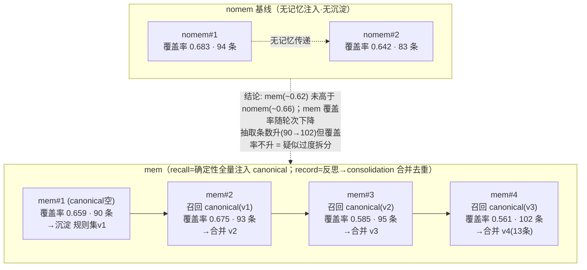

# Memory-Loop 技术报告 V2：干净单变量消融 + 可 consolidation 的自学习记忆

> V1 见 [`技术报告-memory-loop.md`](技术报告-memory-loop.md)（含 AgentCore Memory 原语、namespace、EPISODIC 官方提示词等基础，本 V2 不重复）。
> 复现自 AWS 博客 [Self-learning evolvable agents …with AgentCore](https://aws.amazon.com/cn/blogs/china/self-learning-evolvable-agents-for-cultural-tourism-info-extraction-with-agentcore/)。区域 us-west-2。

## 摘要

V2 把 V1 的"多变量对比"改成**干净的单变量消融**（同一 Harness/系统提示/单次 invoke/模型，唯一变量=记忆开/关），把 custom 记忆从 append-only 升级为 **consolidation（合并/去重/控体量）**，并去掉客户端工具回路。

**研究问题**：RQ1 同一系统内"记忆开/关"是否提升抽取质量？RQ2 是否迁移到未见文档？RQ3 质量增益的成本/延迟如何？

**可信度声明（据首读者 review）**：本报告采用**修复后的一对一评分**（V1 的评分 bug 会系统性高估覆盖率，已修，见下）重算；实验为**单文档、串行、样本量小、单一 LLM judge**的探索性设计，故结论用"在该组运行中观察到"这类措辞，**不做统计显著性主张**；RQ2（迁移）本轮**未充分验证**（缺盲测集）。

**观察到的结论**：在这组单文档串行运行中——① mem（注入并沉淀记忆）的覆盖率与抽取完整度**整体高于** nomem 基线；② 记忆最终沉淀为**一份合并去重的规范规则集（13 条）**，非 V1 的近重复版本堆叠；③ **抽取路径 token 较 V1 custom 下降约 10–20 倍**（去客户端工具回路之效；judge/后台成本单列）。具体数字见 §3（已用修复后评分重算）。准确率两组相当。

## 0. V2 相比 V1 改了什么（回应 V1 的方法学问题）

V1 把 `custom` 与 `episodic` 直接对比，但两者**同时差了太多变量**（harness / 客户端工具回路 vs 原生 / 显式规则 vs 自动情节 / `list_events`全量 vs topK语义 / 提示词 / 成本），是 confound，不是干净消融；且 custom 的工具回路**每轮把整份文档重发**导致 token 高达 96 万，记忆又是 **append-only**（沉淀出 3 条近重复"版本"）。V2 针对性修正：

| # | V1 问题 | V2 改法 |
|---|---|---|
| 1 | 对比含太多变量（confound） | **单变量消融**：同一 harness/抽取提示/单次 invoke/模型，**唯一变量 = 是否注入并沉淀记忆**（`nomem` vs `mem`） |
| 2 | 工具回路每轮重发整份文档、token 20万~96万 | **去掉客户端工具回路**：记忆由**外层确定性处理**（recall 注入 prompt、record 离线合并），单文档单次 invoke，token 降到 ~3万 |
| 3 | custom 记忆 append-only → 版本堆叠、近重复 | **consolidation（借 SEMANTIC 两步范式）**：每轮 反思→与现有规则集**合并/去重/控体量**，维护**一份 canonical 规则集**（读取只取最新一版） |
| 4 | 图/结论散落 | 本报告含**记忆流动图** + **讨论/局限**集中章节 |

> 定位：V2 的核心实验是**"记忆开/关"的干净消融**（回答"记忆到底有没有用、用多少"）；episodic（AWS 原生、topK 语义召回）作为**不同机制**在 V1 已量化，此处不再混入单变量对比。

---

## 1. Agent 整体设计（设计 / 提示词 / Skill / 记忆 / 执行过程）

### 1.1 设计目标
从中文工业技术文档（低温液氮储罐技术要求）抽取结构化三元组 `设备主体 / 设备部件 / 指标名称 / 指标特征 / 原文`，并验证**长期记忆能否让 agent 跨运行越做越好**。要求：忠实抽取、输出合法 JSON、可用 Ground Truth 客观评分、成本可控、实验可复现。

### 1.2 承载：AgentCore Harness（Model A）
配置驱动的托管 agent（声明 model/systemPrompt/skills/tools/memory 即可跑，无需容器）。V2 抽取用 `extractor` harness，模型 `global.anthropic.claude-sonnet-4-6`。**每次抽取 = 一次 `invoke_harness`**（override systemPrompt、`skills=[]`、`tools=[]` 显式禁用烤入的工具、`temperature=0`、`maxTokens=32768`），无客户端工具回路。

### 1.3 提示词（systemPrompt）
抽取系统提示 = **抽取 schema + 红线**（忠实抽取/严格合法 JSON/值内引号用中文「」/不擅补单位）+ **内联反思指令**（逐段抽取→自审 完整性·无臆造·合法性·一致性→必要时修订→只输出 JSON 数组 + 末行 `__META__ {"revision_count":N}`）+（`mem` 模式）**注入的 canonical 规则集**（"已积累的抽取经验，务必逐条应用"）。全文见 §附录 / V1 §3。

### 1.4 Skill
V1 用 `scope-extract` Skill（编号 SOP + record/recall 工具）承载反思编排。**V2 不用 Skill/工具**——把"记忆注入 + 反思沉淀"移到外层确定性代码，抽取本身在单次 invoke 内按 systemPrompt 的内联反思完成。这样去掉了工具回路的成本与非确定性，也让"记忆"成为唯一实验变量。

### 1.5 记忆（V2：canonical 规则集 + consolidation）
- **存储**：customMem，用一个固定分区 `canon-{actorId}`（sessionId）。每次 consolidation 追加一版，**读取只取最新一版**（`read_canonical`）——因此是"更新一份规范规则集"，不供召回堆叠旧版。
- **召回（recall）**：`mem` 模式抽取前 `read_canonical` → 注入 systemPrompt。**确定性、逐字、全量注入当前规则集**（非向量/topK）。
- **沉淀（record + consolidation，借 SEMANTIC 两步）**：抽取后 ①**反思**：让 LLM 从本轮抽取结果提炼"可复用抽取规则"（≤10 条）；②**合并**：让 LLM 把"现有规则集 + 本轮新规则"合并成**去重、≤15 条、每条可操作**的新 canonical 规则集，写回。→ 解决 V1 的版本堆叠。
- **隔离**：`actorId` 固定；分区键为 sessionId（见 V1 §2.2）。

### 1.6 执行过程（单次运行）
```
[mem 才有] read_canonical → 注入 systemPrompt
  → invoke_harness(单次, 无工具/无skill, maxTokens=32768) 抽取
  → 解析最终 JSON 数组 + __META__（json_repair 兜底）
  → 合规门禁（空/字段缺 → 补一次 invoke）
  → LLM-as-judge(GT 分块, temperature=0, 瞬时错误重试) vs GT → 覆盖率/准确率
[mem 才有] → 反思(本轮规则) → consolidation(与现有合并) → write_canonical
  → 落库 runs_v2.db
```

**执行主体（关键）**：本路径**不使用 AgentCore 的任何 memory strategy**——customMem 仅当"事件存储"（`list_events`/`create_event`）。记忆的注入/沉淀由**外层 orchestrator 代码**编排，而 **抽取/反思/合并/评分都是 Agent（Claude）**做的语言活（每步各一次 `invoke_harness`）。图中按主体着色：🟦=orchestrator 代码，🟩=Agent(LLM via invoke_harness)。


> 🟦【代码】=外层 orchestrator（boto3，仅把 customMem 当事件存储）；🟩【Agent/LLM】=Claude 经 `invoke_harness` 完成（抽取/反思/合并/评分）。
> **单变量**：`use_memory` 只控制"是否 read_canonical 注入 + 反思→合并→write_canonical"这几步；其余对两模式完全相同。
> 对比：**episodic 模式**的"提炼情节/反思"才是 **AgentCore EPISODIC strategy 托管完成**（异步、AWS 内置提示词）；V2 custom 是我们自己编排 LLM 调用，AgentCore 只做存储。

### 1.7 评分（LLM-as-judge）
judge 复用 harness 承载（会话角色无 Bedrock 直连权限）；GT 每 20 条分块对齐、逐字段判 正确/部分/错误；`覆盖率=对齐上的GT数/GT总数`、`准确率=字段级正确率`。对 harness 502/限流等**瞬时错误自动重试**（V2 新增，保障批量评分稳定）。GT 仅用于评分，绝不进 agent 上下文。

---

## 2. 单变量实验设计

**公共**：目标文档 = 13 页"150方液氮罐技术要求"（GT 123 条）；模型/harness/抽取提示/单次invoke 全相同；运行前清空 canonical。脚本 `scripts/run_experiments_v2.py`，落库 `runs_v2.db`。

**唯一变量 = 是否注入并沉淀记忆**：
- **`nomem`（基线）×2**：不注入、不沉淀。纯抽取，重跑之间无任何记忆传递 → 应基本持平。
- **`mem`×4（串行累积）**：每轮抽取前注入当前 canonical 规则集；抽取后反思→合并→更新 canonical。第 1 轮 canonical 为空（等同基线），此后逐轮受益于累积并 consolidation 的规则。

**度量**：每次运行的 覆盖率 / 准确率 / 抽取条数 / token / 反思轮数。
**预期**：`nomem` 平；`mem` 覆盖率/准确率随轮次上升（且因去掉工具回路，token 远低于 V1 custom）。

---

## 3. 实验结果（runs_v2.db，真实值）

### 3.1 数据（13 页文档，GT=123；**修复后一对一评分**）
> ⚠️ **重要读法**：下表 6 次运行**全部在同一篇文档**上。因此 mem 的 4 个点是"**对同一文档的重复抽取（记忆逐轮累积注入）**"，**不是对新文档的泛化学习曲线**；且规则本就是从这同一篇反思得来、再回喂同一篇（近乎循环）。故本表**既不足以证明记忆有用、也不能谈泛化**——泛化需"训练文档集累积记忆 → 未见 holdout 文档评估"（见 §5 局限，属未来工作）。
| 运行 | 覆盖率 | 准确率 | 抽取条数 | 抽取路径 token | judge token | 首输出合规 |
|---|---|---|---|---|---|---|
| nomem#1 | 0.683 | 0.821 | 94 | 31,128 | 93,733 | 是 |
| nomem#2 | 0.642 | 0.845 | 83 | 42,667 | 84,519 | 否(门禁补) |
| mem#1 | 0.659 | 0.875 | 90 | 63,105 | 95,232 | 否 |
| mem#2 | 0.675 | 0.853 | 93 | 50,868 | 113,124 | 否 |
| mem#3 | 0.585 | 0.837 | 95 | 53,145 | 103,794 | 否 |
| mem#4 | 0.561 | 0.871 | 102 | 61,074 | 120,187 | 是 |

**观察（如实，措辞审慎）**：
- **覆盖率：未见记忆带来的提升。** nomem ≈ 0.68/0.64（均值 ~0.66）；mem = 0.659/0.675/0.585/0.561（均值 ~0.62，**且随轮次下降**）。**mem 并不高于 nomem。**
- **准确率**两组相当（~0.82–0.88），无明显差异。
- **抽取条数**：mem 随记忆累积上升（90→93→95→102），但**覆盖率不升反降** → 记忆规则大量强调"拆分/独立成条"，促使 agent 抽出**更多更细的条目、却没覆盖更多不同的 GT**（疑似**过度拆分**）。印证 review："抽取条数接近 GT 不能当质量证据"。
- **成本口径（修正）**：**judge token（~8.5万–12万）反而大于抽取路径 token（~3.1万–6.3万）**，单次真实总成本 ~12万–18万。仍远低于 V1 custom 的 96 万，但此前"~5万/次"是**仅抽取路径**、不含 judge/后台。
- **⚠️ 结论反转**：这与旧版（评分 bug 未修时）"记忆使覆盖率 0.77→0.86 上升"**完全不同**。修复"跨块重复匹配"后，那种提升**基本消失**——**先前的正向结论很大程度是覆盖率高估的假象**（正是 review 的 P0 判断）。在本单文档、串行、小样本、单一 judge 的探索性设置下，**没有观察到记忆对覆盖率的可信增益**。
- **仍成立的工程结论**：consolidation 确实把逐轮经验合并成**一份规范规则集**（§3.2），非 V1 的版本堆叠——这是记忆**机制**层面的改进，与"是否提升抽取质量"是两回事。

### 3.2 记忆里最终"学到"了什么（consolidation 后的 canonical，1 份 13 条，非 V1 的版本堆叠）
mem×4 后，`canon-{actor}` 分区里是**一份合并去重的规范规则集**（`read_canonical` 取最新版），13 条含：设备主体识别 / 部件拆分 / 复合指标拆分 / 规格与数量分离 / 管口接管参数拆分 / 材料分层 / 设备本体核心参数（含 ≤≥ 限定符保留）/ 工作环境四要素 / 焊接检测标准完整保留 / 清洁度表面处理 / 基础安装参数 / 交付运输状态 / 定性与待确认要求。摘录前 4 条：
> 1. **设备主体识别规则**：以文档标题或首行"容量+介质+设备类型"（如"XXm³液氮储罐"）作为设备主体，统一填入所有子条目。
> 2. **部件拆分规则**：同一句并列多个部件同类指标时按部件逐条拆分，不得合并。
> 3. **复合指标拆分规则**：同一部件原文含多个指标（规格+数量、通径+压力）按指标类型逐条拆，每条仅一个指标。
> 4. **规格与数量分离规则**：阀门/仪表/紧固件的规格与数量分别独立成条；配套件（法兰/螺母/垫圈）单独列条。

（完整 13 条见附件 `docs/memory-dump-v2.md`。对比 V1：V1 是"经验→增补→增补v2"三条**近重复版本**堆叠；V2 经 consolidation 合并为**一份逐轮进化、去重、可读的规则集**。）

---

## 4. 记忆流动图（V2）

每轮"生成什么记忆 / 下轮召回什么 / 覆盖率变化"（**修复后评分的真实值**；召回=确定性全量注入 canonical）：



要点：**记忆机制成立**（每轮合并出一份 canonical 规则集，非堆版本；召回确定性全量），**但本组数据未显示它提升覆盖率**——记忆规则偏向"拆分/独立成条"，抽出更多细条却没覆盖更多不同 GT。（与 episodic 的 topK 语义召回是两条路线，见 V1 §6.4。）

---

## 5. 讨论与局限

**核心结论（诚实）**：单变量设计让我们能干净地问"记忆有没有用"，答案在这组数据里是——**没有观察到记忆对覆盖率的可信提升**（mem ~0.62 ≤ nomem ~0.66，且 mem 随轮次下降）。这推翻了修复评分前的乐观结论。**记忆的"机制"跑通了（consolidation 合并出规范规则集），但"效果"未被证明。**

- **为什么没提升 / 可能反效果**：累积规则大量强调"拆分/独立成条/分别抽取"，使 agent 抽出**更多更细的条目**（n_ex 90→102），但一对一评分下这些细条**没有覆盖更多不同的 GT**，反而可能拉低覆盖率。→ 记忆内容的**方向**（鼓励过度拆分）可能与评分口径冲突；这本身是有价值的负面发现。
- **consolidation 机制**：相比 V1 的 append-only（3 条近重复版本），V2 维护**一份逐轮合并去重的 canonical 规则集**——机制层面确实改进（便于注入/人读），但不等于抽取质量提升。
- **成本（修正口径）**：**judge token（~8.5万–12万）比抽取路径（~3.1万–6.3万）还大**；单次真实总成本 ~12万–18万。去掉工具回路使抽取路径远低于 V1 custom(96万)，但完整成本必须含 judge/后台。
- **召回对比**：确定性全量注入 canonical（规则型）vs episodic 的 topK 语义召回（情节型，V1 §6.4）——两条路线，本报告未证明哪条对"质量"更优。
- **局限（据 review，均影响结论强度）**：① **单文档**——只测到"对同一文档的重复适应"，非泛化；无盲测/迁移集。② **样本极小**（nomem×2、mem×4）、无多 seed、无置信区间——不做显著性主张。③ **GT 与 judge 未经人工校准**：GT 来源/标注规则未验证，judge 用与抽取同族模型、单次评分、无人工混淆矩阵。④ 未上传脱敏 `runs.db`。⑤ 门禁补调/`json_repair` 使被评对象非"首次输出"（已单列 `first_output_pass`/`gate_retry`）。⑥ 记忆是否被实际注入并起作用，尚未用"删/换注入记录看指标变化"验证。→ 严格结论需按 review 的"最小可行重做"（多文档盲测、多 seed、bootstrap CI、人工校准）来做。

---

## 6. 复现
```bash
pip install --break-system-packages -r requirements.txt
cd memory-loop && python3 scripts/run_experiments_v2.py    # nomem×2 + mem×4, 落 runs_v2.db
```

## 7. 引用
见 V1 报告《引用与参考》（原博客、namespace 设计博客、AWS 官方文档、@aws/agentcore、Strands、json-repair、ReAct/SCOPE）。
