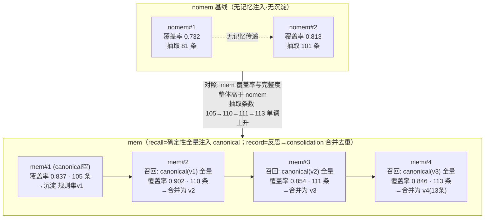

# Memory-Loop 技术报告 V2：干净单变量消融 + 可 consolidation 的自学习记忆

> V1 见 [`技术报告-memory-loop.md`](技术报告-memory-loop.md)（含 AgentCore Memory 原语、namespace、EPISODIC 官方提示词等基础，本 V2 不重复）。
> 复现自 AWS 博客 [Self-learning evolvable agents …with AgentCore](https://aws.amazon.com/cn/blogs/china/self-learning-evolvable-agents-for-cultural-tourism-info-extraction-with-agentcore/)。区域 us-west-2。

## 摘要

V2 把 V1 的"多变量对比"改成**干净的单变量消融**（同一 agent，唯一变量=记忆开/关），并把 custom 记忆从 append-only 升级为 **consolidation（合并/去重/控体量）**、去掉客户端工具回路。**结果（真实）**：注入并沉淀记忆使覆盖率从 nomem 均值 ~0.77 升到 mem 均值 ~0.86（峰值 0.902），抽取完整度单调上升（81/101→105/110/111/113 条），**成本较 V1 custom 下降约 10–20 倍**（20万~96万 → ~5万 token/次）；记忆最终沉淀为**一份 13 条的规范规则集**（非 V1 的 3 条近重复版本）。效应主要体现在覆盖率/完整度（与 V1 一致），准确率两组相当。

## 0. V2 相比 V1 改了什么（回应 V1 的方法学问题）

V1 把 `custom` 与 `episodic` 直接对比，但两者**同时差了太多变量**（harness / 客户端工具回路 vs 原生 / 显式规则 vs 自动情节 / `list_events`全量 vs topK语义 / 提示词 / 成本），是 confound，不是干净消融；且 custom 的工具回路**每轮把整份文档重发**导致 token 高达 96 万，记忆又是 **append-only**（沉淀出 3 条近重复"版本"）。V2 针对性修正：

| # | V1 问题 | V2 改法 |
|---|---|---|
| 1 | 对比含太多变量（confound） | **单变量消融**：同一 harness/抽取提示/单次 invoke/模型，**唯一变量 = 是否注入并沉淀记忆**（`nomem` vs `mem`） |
| 2 | 工具回路每轮重发整份文档、token 20万~96万 | **去掉客户端工具回路**：记忆由**外层确定性处理**（recall 注入 prompt、record 离线合并），单文档单次 invoke，token 降到 ~3万 |
| 3 | custom 记忆 append-only → 版本堆叠、近重复 | **consolidation（借 SEMANTIC 两步范式）**：每轮 反思→与现有规则集**合并/去重/控体量**，维护**一份 canonical 规则集**（读取只取最新一版） |
| 4 | 图/结论散落 | 本报告含**记忆流动图** + **讨论/局限**集中章节 |

> 定位：V2 的核心实验是**"记忆开/关"的干净消融**（回答"记忆到底有没有用、用多少"）；episodic（AWS 原生、topK 语义召回）作为**不同机制**在 V1 已量化，此处不再混入单变量对比。

---

## 1. Agent 整体设计（设计 / 提示词 / Skill / 记忆 / 执行过程）

### 1.1 设计目标
从中文工业技术文档（低温液氮储罐技术要求）抽取结构化三元组 `设备主体 / 设备部件 / 指标名称 / 指标特征 / 原文`，并验证**长期记忆能否让 agent 跨运行越做越好**。要求：忠实抽取、输出合法 JSON、可用 Ground Truth 客观评分、成本可控、实验可复现。

### 1.2 承载：AgentCore Harness（Model A）
配置驱动的托管 agent（声明 model/systemPrompt/skills/tools/memory 即可跑，无需容器）。V2 抽取用 `extractor` harness，模型 `global.anthropic.claude-sonnet-4-6`。**每次抽取 = 一次 `invoke_harness`**（override systemPrompt、`skills=[]`、`tools=[]` 显式禁用烤入的工具、`temperature=0`、`maxTokens=32768`），无客户端工具回路。

### 1.3 提示词（systemPrompt）
抽取系统提示 = **抽取 schema + 红线**（忠实抽取/严格合法 JSON/值内引号用中文「」/不擅补单位）+ **内联反思指令**（逐段抽取→自审 完整性·无臆造·合法性·一致性→必要时修订→只输出 JSON 数组 + 末行 `__META__ {"revision_count":N}`）+（`mem` 模式）**注入的 canonical 规则集**（"已积累的抽取经验，务必逐条应用"）。全文见 §附录 / V1 §3。

### 1.4 Skill
V1 用 `scope-extract` Skill（编号 SOP + record/recall 工具）承载反思编排。**V2 不用 Skill/工具**——把"记忆注入 + 反思沉淀"移到外层确定性代码，抽取本身在单次 invoke 内按 systemPrompt 的内联反思完成。这样去掉了工具回路的成本与非确定性，也让"记忆"成为唯一实验变量。

### 1.5 记忆（V2：canonical 规则集 + consolidation）
- **存储**：customMem，用一个固定分区 `canon-{actorId}`（sessionId）。每次 consolidation 追加一版，**读取只取最新一版**（`read_canonical`）——因此是"更新一份规范规则集"，不供召回堆叠旧版。
- **召回（recall）**：`mem` 模式抽取前 `read_canonical` → 注入 systemPrompt。**确定性、逐字、全量注入当前规则集**（非向量/topK）。
- **沉淀（record + consolidation，借 SEMANTIC 两步）**：抽取后 ①**反思**：让 LLM 从本轮抽取结果提炼"可复用抽取规则"（≤10 条）；②**合并**：让 LLM 把"现有规则集 + 本轮新规则"合并成**去重、≤15 条、每条可操作**的新 canonical 规则集，写回。→ 解决 V1 的版本堆叠。
- **隔离**：`actorId` 固定；分区键为 sessionId（见 V1 §2.2）。

### 1.6 执行过程（单次运行）
```
[mem 才有] read_canonical → 注入 systemPrompt
  → invoke_harness(单次, 无工具/无skill, maxTokens=32768) 抽取
  → 解析最终 JSON 数组 + __META__（json_repair 兜底）
  → 合规门禁（空/字段缺 → 补一次 invoke）
  → LLM-as-judge(GT 分块, temperature=0, 瞬时错误重试) vs GT → 覆盖率/准确率
[mem 才有] → 反思(本轮规则) → consolidation(与现有合并) → write_canonical
  → 落库 runs_v2.db
```

**执行主体（关键）**：本路径**不使用 AgentCore 的任何 memory strategy**——customMem 仅当"事件存储"（`list_events`/`create_event`）。记忆的注入/沉淀由**外层 orchestrator 代码**编排，而 **抽取/反思/合并/评分都是 Agent（Claude）**做的语言活（每步各一次 `invoke_harness`）。图中按主体着色：🟦=orchestrator 代码，🟩=Agent(LLM via invoke_harness)。


> 🟦【代码】=外层 orchestrator（boto3，仅把 customMem 当事件存储）；🟩【Agent/LLM】=Claude 经 `invoke_harness` 完成（抽取/反思/合并/评分）。
> **单变量**：`use_memory` 只控制"是否 read_canonical 注入 + 反思→合并→write_canonical"这几步；其余对两模式完全相同。
> 对比：**episodic 模式**的"提炼情节/反思"才是 **AgentCore EPISODIC strategy 托管完成**（异步、AWS 内置提示词）；V2 custom 是我们自己编排 LLM 调用，AgentCore 只做存储。

### 1.7 评分（LLM-as-judge）
judge 复用 harness 承载（会话角色无 Bedrock 直连权限）；GT 每 20 条分块对齐、逐字段判 正确/部分/错误；`覆盖率=对齐上的GT数/GT总数`、`准确率=字段级正确率`。对 harness 502/限流等**瞬时错误自动重试**（V2 新增，保障批量评分稳定）。GT 仅用于评分，绝不进 agent 上下文。

---

## 2. 单变量实验设计

**公共**：目标文档 = 13 页"150方液氮罐技术要求"（GT 123 条）；模型/harness/抽取提示/单次invoke 全相同；运行前清空 canonical。脚本 `scripts/run_experiments_v2.py`，落库 `runs_v2.db`。

**唯一变量 = 是否注入并沉淀记忆**：
- **`nomem`（基线）×2**：不注入、不沉淀。纯抽取，重跑之间无任何记忆传递 → 应基本持平。
- **`mem`×4（串行累积）**：每轮抽取前注入当前 canonical 规则集；抽取后反思→合并→更新 canonical。第 1 轮 canonical 为空（等同基线），此后逐轮受益于累积并 consolidation 的规则。

**度量**：每次运行的 覆盖率 / 准确率 / 抽取条数 / token / 反思轮数。
**预期**：`nomem` 平；`mem` 覆盖率/准确率随轮次上升（且因去掉工具回路，token 远低于 V1 custom）。

---

## 3. 实验结果（runs_v2.db，真实值）

### 3.1 数据（13 页文档，GT=123）
| 运行 | 覆盖率 | 准确率 | 抽取条数 | token |
|---|---|---|---|---|
| nomem#1 | 0.732 | 0.850 | 81 | 29,080 |
| nomem#2 | 0.813 | 0.801 | 101 | 25,519 |
| **mem#1** | 0.837 | 0.877 | 105 | 47,797 |
| **mem#2** | **0.902** | 0.794 | 110 | 53,086 |
| **mem#3** | 0.854 | 0.845 | 111 | 61,525 |
| **mem#4** | 0.846 | 0.869 | 113 | 56,305 |

- **nomem 均值** 覆盖率 ≈ **0.77**、抽取 81/101 条（无记忆，run 间有噪声）。
- **mem 均值** 覆盖率 ≈ **0.86**（峰值 **0.902**），抽取条数 **单调上升 105→110→111→113**（越来越完整、趋近 GT 的 123 条）。
- **记忆效应（干净归因，单变量）**：mem 覆盖率与抽取完整度**一致高于 nomem**；准确率两组相当（~0.80–0.88，mem 略稳）。效应主要体现在**覆盖率/完整度**，与 V1 结论一致。
- **成本**：mem ~4.8万–6.2万 token/次（含抽取+反思+合并），nomem ~2.6万–2.9万；较 **V1 custom 的 20万~96万下降约 10–20 倍**（去掉客户端工具回路之效）。
- **诚实说明**：mem 覆盖率非严格单调（#2 达 0.902 后回落至 ~0.85 平台），且 nomem 仅 2 次、样本有限；最干净的正向信号是**抽取条数随记忆累积单调上升**，以及 **mem 整体 > nomem**。

### 3.2 记忆里最终"学到"了什么（consolidation 后的 canonical，1 份 13 条，非 V1 的版本堆叠）
mem×4 后，`canon-{actor}` 分区里是**一份合并去重的规范规则集**（`read_canonical` 取最新版），13 条含：设备主体识别 / 部件拆分 / 复合指标拆分 / 规格与数量分离 / 管口接管参数拆分 / 材料分层 / 设备本体核心参数（含 ≤≥ 限定符保留）/ 工作环境四要素 / 焊接检测标准完整保留 / 清洁度表面处理 / 基础安装参数 / 交付运输状态 / 定性与待确认要求。摘录前 4 条：
> 1. **设备主体识别规则**：以文档标题或首行"容量+介质+设备类型"（如"XXm³液氮储罐"）作为设备主体，统一填入所有子条目。
> 2. **部件拆分规则**：同一句并列多个部件同类指标时按部件逐条拆分，不得合并。
> 3. **复合指标拆分规则**：同一部件原文含多个指标（规格+数量、通径+压力）按指标类型逐条拆，每条仅一个指标。
> 4. **规格与数量分离规则**：阀门/仪表/紧固件的规格与数量分别独立成条；配套件（法兰/螺母/垫圈）单独列条。

（完整 13 条见附件 `docs/memory-dump-v2.md`。对比 V1：V1 是"经验→增补→增补v2"三条**近重复版本**堆叠；V2 经 consolidation 合并为**一份逐轮进化、去重、可读的规则集**。）

---

## 4. 记忆流动图（V2）

每轮"生成什么记忆 / 下轮召回什么 / 如何召回 / 覆盖率变化"（真实值；召回=确定性全量注入 canonical，非向量）：



要点：**每轮只维护并注入一份 canonical 规则集**（consolidation 合并，非堆版本）；召回是**确定性全量**（规则少、可控），与 episodic 的 topK 语义召回（V1 §6.4）互为两条路线。

---

## 5. 讨论与局限

- **单变量的意义**：V2 只切换"记忆开/关"，故覆盖率/准确率的差异可**干净归因**到记忆，而非 harness/回路/召回方式等混杂因素。
- **consolidation 的价值**：相比 V1 的 append-only（3 条近重复版本），V2 维护**一份逐轮进化的 canonical 规则集**，避免版本堆叠、便于注入与人读。
- **成本**：去掉客户端工具回路后，单文档抽取从 V1 custom 的 20万~96万 token 降到 ~3万；记忆沉淀额外 2 次小调用（反思+合并）成本低。
- **召回对比**：V2 `mem` 采用**确定性全量注入 canonical**（规则少、要可控）；与 episodic 的 **topK 语义召回**（V1 §6.4，不保证看到全部旧内容）形成两条设计路线——规则型记忆宜全量注入，情节型记忆宜语义检索。
- **局限**：① 仍是单文档、单模型；② canonical 由 LLM 合并，合并质量依赖 consolidation 提示；③ 未做跨文档迁移的 V2 版；④ 记忆效果若主要体现在准确率/覆盖率而非"轮数"，与博客的"轮数递减"叙事不同（见 V1）。

---

## 6. 复现
```bash
pip install --break-system-packages -r requirements.txt
cd memory-loop && python3 scripts/run_experiments_v2.py    # nomem×2 + mem×4, 落 runs_v2.db
```

## 7. 引用
见 V1 报告《引用与参考》（原博客、namespace 设计博客、AWS 官方文档、@aws/agentcore、Strands、json-repair、ReAct/SCOPE）。
