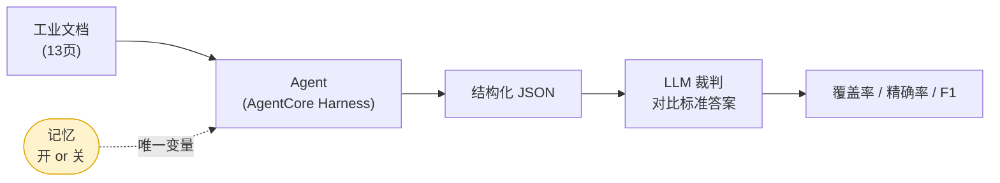
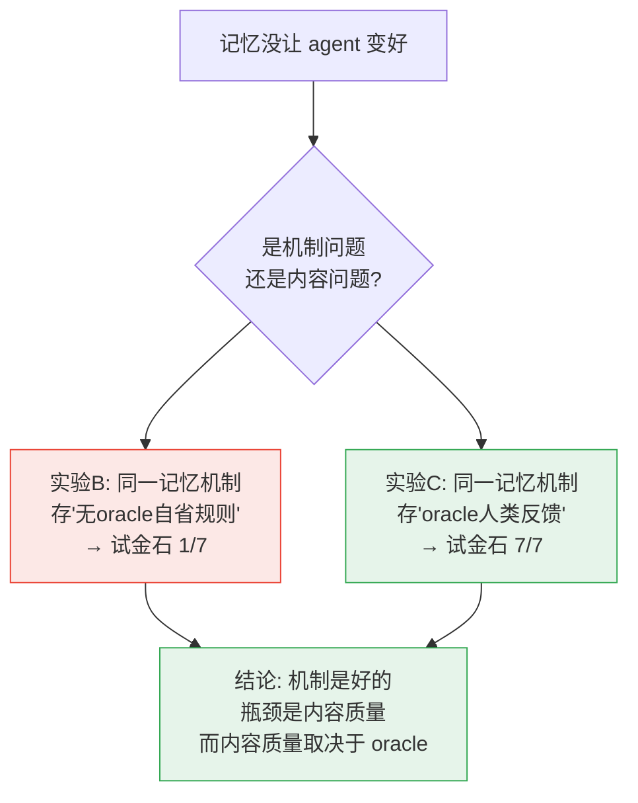

# 记忆能让 AI Agent 越跑越好吗？——一次关于 AgentCore Memory 的诚实实验

> 复现自 AWS 博客《[Self-learning evolvable agents for cultural tourism info extraction with AgentCore](https://aws.amazon.com/cn/blogs/china/self-learning-evolvable-agents-for-cultural-tourism-info-extraction-with-agentcore/)》，任务换成**中文工业技术文档抽取**（低温液氮储罐技术要求）。本文是 V1/V2 两轮实验的最终综合版，替代此前的技术报告作为结论。区域 us-west-2。

## 一句话结论（先给答案）

给 agent 加长期记忆，它会不会"越用越聪明"？

**会，但真正的飞跃，取决于回路里有没有一个 oracle——一个能告诉 agent "对不对 / 该抽什么"的外部权威（标准答案、人类反馈、或带评分标准的裁判）。**

- 记忆机制本身是好的——把累积的经验注入下一次运行，确实能生效。
- 就算没有人类干预，记忆也能学到**一些**有用的东西：靠对照原文的自我批评，它能发现"文档提到了 X、我没抽 X"这类**源覆盖**问题（我们的实验里，无标准答案也救回了 4–10 条漏项）。
- 但只靠模型对自己产出的抽象自省，**够不着**更关键的一类问题（"这类东西本来就该抽"）——那需要外部信号。
- 一旦把 oracle 质量的反馈存进记忆，同一套机制立刻**突飞猛进**（我们的关键指标从 1/7 跳到 7/7）。

**记忆是好的载体，不是好的老师。** 这篇文章讲我们怎么一步步逼出这个结论——包括中途一个把我们骗了的 bug。

---

## 1. 我们在测什么

任务很简单：从一份 13 页的中文工业技术文档里，抽出结构化条目 `设备主体 / 设备部件 / 指标名称 / 指标特征 / 原文`，和人工标注的标准答案（123 条）对比打分。

我们把实验设计成**只有一个变量：记忆开 / 关**。其余（模型、提示词、单次调用方式）两组完全一样。这样"记忆到底有没有用"才能干净地回答。



**三个衡量指标**，贯穿全文：
- **覆盖率（召回）**：抽出的条目覆盖了多少标准答案。
- **精确率**：抽出的条目里有多少是对的（惩罚"乱抽/过度拆分"）。
- **F1**：前两者的调和平均，综合看。

还有一个诊断指标后面会反复用到——**recall_fail（真召回失败数）**：标准答案里某条，和我们抽出的**任何**条目都毫无重叠，即"根本没抽出来"。它和"抽了但对不齐"是两回事，区分它们是整个故事的关键。

---

## 2. 第一版结果骗了我们

第一轮实验（V1）看起来非常鼓舞人心：带记忆的模式覆盖率一路走高，0.82 → 0.87，像教科书里的"自学习曲线"。我们差点就此收工。

**幸好多问了一句：这个尺子准吗？** 结果发现两个问题，足以推翻结论：

1. **评分有 bug。** 裁判分块打分时，缺了一个全局约束，导致**同一个抽取项可以被重复算去匹配多条标准答案**。后果是覆盖率被系统性高估。这个 bug 有铁证：某次运行只抽了 91 条，却报"匹配上 94 条标准答案"——**94 > 91 在一对一对齐下根本不可能**。

2. **对比不干净。** 那个"表现好"的记忆模式，其实偷偷用了**另一个更强的抽取器**（能抽更完整），而且**没有冷启动**（复用了之前跑积累的记忆）。所以它领先的时候，记忆甚至还是空的——领先跟记忆无关。

**修好评分、拉平所有变量、冷启动重跑之后，记忆的增益消失了。** 带记忆和不带记忆打平，甚至略低。

> **教训一：先怀疑自己的尺子。** 一个乐观的结果，如果来自没校准的度量，比没有结果更危险。

---

## 3. 为什么没用？——不轻易下"记忆无效"的结论

"打平"很容易让人写下"记忆没用"就收场。但这是偷懒。我们改成问：**到底漏了什么？漏的东西有规律吗？**

于是把所有漏抽的标准答案捞出来，按前面说的 recall_fail 分类。发现一个清晰的规律：**漏掉的大部分（约 3/4）是"真召回失败"——根本没抽出来**。而这些没抽出来的东西高度同质：

```
「外观颜色及喷涂 LOGO 须与甲方确认」
「真空度测量报告」/「真空度测量要求」
「外部油漆等工序」
「承制单位细化设计…提供全套地脚螺栓」
```

它们**都不是"设备+部件+指标+数值"这种定量三元组**，而是散文式、流程式、待确认类的要求。

**根因找到了**：我们的抽取 schema 天生面向定量指标。模型看到一句没有数值、只有要求的话，就默认"这不是一条指标"，直接跳过。**漏的不是模型能力，是它以为这些不该抽。**

> **教训二："没效果"往往不是终点，而是一个还没做的错误分析。** 不做归因就下结论，可能把"提示词/任务定义问题"误判成"方法无效"。

---

## 4. 三个实验，锁定因果

有了诊断，我们做了三个环环相扣的实验，最终把因果彻底钉死。

### 实验 A：把漏项当线索，改提示词 —— 有效

不改 schema，只在提示词里显式加一句：**"非定量要求（定性/流程/报告/待确认类）也要抽，把要求类型放进『指标名称』、要求内容放进『指标特征』"**，并附上刚才那几个真实漏项当示例。

> **先说清一个贯穿全文的诊断探针——「散文类试金石」。** 我们从 §3 那批"真召回失败"里挑出 7 个代表词：`真空度测量 / 外观颜色 / 喷涂 / 油漆 / 地脚螺栓 / 与甲方确认 / 细化设计`，然后看抽取结果里出现了几个。它专门探测"散文/流程类要求这一类，到底抽没抽到"——是"任务规格类教训"学没学会的试金石。**7/7 = 这 7 类散文要求全抓到；1/7 = 只碰到 1 类。**（它和覆盖率不同：覆盖率是整体一对一匹配率，试金石只盯这一类最能区分成败的漏项。）

效果立竿见影：

| | 覆盖率 | recall_fail | 散文类抽到几个 |
|---|---|---|---|
| 基线（无此提示） | 0.642 | **27** | 1 / 7 |
| **加了提示词** | **0.715** | **1** | **7 / 7** |

真召回失败从 27 塌到 1，之前漏的散文类全抓到了。**证明这是提示词/任务定义问题，改得动**——不是方法无效。

**但这里有个必须讲清的反差：recall_fail 从 27 崩到 1（几乎归零），覆盖率却只从 0.642 涨到 0.715（+0.07）。为什么？**

因为这是**两把不同的尺，量的是两件事**：

- **recall_fail 是一把"松"尺**（确定性关键词重叠）：只问"这条标准答案 和我抽出的**任何**一条有没有词面重叠？"。改了提示词后，模型**开始去抽**那些散文类原文了，于是几乎每条标准答案 都能找到一条"沾边"的抽取项——recall_fail 自然崩到接近 0。它衡量的是**"我们有没有不再整片忽略某类内容"**。
- **覆盖率是一把"严"尺**（LLM 裁判，一对一语义对齐）：它要求裁判为每条标准答案 找到一条**能干净配对、判为真匹配**的抽取项。"沾边"不算数。

反差就来自这里：**"开始抽了"（沾边）≠ "抽得刚好能一对一对上标准答案"**。新抽出的散文条目虽然覆盖了话题，但常常：
1. **粒度和标准答案 对不齐**——模型把一段要求拆/并的方式和标准答案 不同，裁判判成"部分"而非干净命中（在残余漏抽里，这类"粒度/对齐问题"占了主要部分，真正的零重叠只剩 1 条）；
2. **多抽带来精确率代价**——抽取条数从 83 涨到 126（+43 条），其中一些是重复或范围没界定好的，配不上一条独立标准答案，于是**精确率从 ~0.85 降到 0.698**，覆盖率也就抬不了那么多。

**换句话说：+0.07 的覆盖率其实"低估"了真实进步。** 我们已经从"整类视而不见"变成了"基本都抽到、只是粒度还没对齐裁判的口径"——recall_fail 27→1 才是这一步质变的真实刻度；覆盖率受限于一对一对齐的严格度和多抽的精确率代价，只反映了其中"能干净配对"的那部分。（残余的粒度问题是评分口径问题，可继续优化，但它不再是"召回失败"。）

这条改进是我们**拿标准答案做错误分析**得来的。有人会说"你用了标准答案，作弊"。但先别急——

### 真正该问的问题：真实回路里，反馈本来就有

现实中的 agent 任务，往往**并不缺这种反馈**：要么有**人类反馈**（用户/专家纠正"这类也要抽"），要么可以让**一个大模型对比标准答案或规范做检查**、产出反馈。所以真正该问的不是"没有反馈怎么办"，而是：

> **这种反馈被记忆系统捕获之后，实际有效吗？记忆到底是不是一个好的载体？**

我们用两个实验回答。

### 实验 C：让大模型对比标准答案产出反馈、写进记忆 —— 有效

我们让**一个大模型对比"抽取结果"和"标准答案"，产出可迁移的改进反馈**（"你系统性漏抽了散文/流程类要求，应该把非定量要求也抽出来、映射进指标字段……"——是**规则性指引，不是照抄答案**），把这条反馈写进 AgentCore Memory，然后用**基线提示词**重新抽取、**只从记忆注入这条反馈**。关键约束：**标准答案只进"检查器"，绝不进抽取器**。

| | 覆盖率 | 精确率 | F1 | recall_fail | 散文类 |
|---|---|---|---|---|---|
| 基线 | 0.642 | – | – | 27 | 1 / 7 |
| **大模型反馈写进记忆** | **0.813** | 0.813 | **0.813** | **2** | **7 / 7** |

**目前最好的一次。** 这正是真实回路的缩影：**大模型（或人类）对比目标给反馈 → 记忆捕获 → 下一次直接受益**。

> ⚠️ 别误读成"记忆比提示词强"：这里 0.813（记忆）> 0.715（提示词）**主要是 run 间方差**——同一份文档、同样设置，覆盖率本就在 0.55–0.81 间跳（见局限）。两者装的是**同一条教训**，结论是"**放提示词还是放记忆都能兑现增益**"，不是"记忆更优"。真正稳健、能区分成败的信号是**散文类试金石都到了 7/7**、recall_fail 都降到个位数。

> 这个"大模型对比标准答案产出反馈"我们做了两种实例，结论一致：一是交互式地做（分析师带上下文提炼反馈），二是一个**固定提示词的自动检查器脚本**（`run_experiment_llm_feedback.py`，冷启动只看"抽取结果+标准答案"就吐出反馈、hands-off、可复现）。后者证明这套回路**不依赖某个特别聪明的人在场**，可以自动跑。〔自动脚本版的精确数字见附录 C〕

### 实验 B（对照）：如果换成"记忆自省"、没有反馈呢？

为了确认增益来自**反馈内容**、而不是"往上下文里塞了更多字"，做个对照：把记忆改成让模型**反思自己的输出**、蒸馏成"可复用规则"（全程**没有标准答案、没有外部反馈**），存进记忆、下轮注入。这正是我们**最初**的记忆设计。

结果：跑几轮、沉淀十几条规则，那根"试金石"（散文类抓到几个）**纹丝不动，钉死在 1 / 7**。

模型学不到"该抽散文类"——因为它只看自己的产出，没有任何外部信号告诉它"这些也算数"。它能蒸馏出的只是通用文风规则（"复合指标要拆分"），碰不到真问题，甚至因过度强调"拆分"而**帮倒忙**（把句子切碎、拉低精确率）。

### 决定性对照

把实验 B 和 C 并排看——**注入路径完全相同（都是记忆），唯一的差别是内容质量**：

| 记忆里存的内容 | 来源 | 散文类试金石 |
|---|---|---|
| 模型对自己产出的自省规则 | 无 oracle | **1 / 7**（学不到）|
| 大模型对比标准答案产出的反馈 | 有 oracle | **7 / 7**（全学会）|

**因果就此锁定：记忆的注入机制一直是好的。之前记忆在这条教训上没起作用，是因为"无 oracle 自省"够不着"该抽什么"这类问题——它产出的是通用文风规则，而非指名道姓的漏项。**



---

## 4.5 一个必须讲清的概念：Oracle

前面反复出现"oracle"。它是整篇的关键，值得单独讲清。

**Oracle（判定源）= 一个能告诉 agent「对不对 / 该抽什么」的外部权威。** 术语来自软件测试的 "test oracle"。核心特征：**它提供的信息，从输入本身推不出来**——必须由外部权威给。

它有很多形式，标准答案只是其中一种：

| oracle 形式 | 它告诉 agent 什么 | 现实中常见吗 |
|---|---|---|
| **标准答案 (标准答案)** | 这篇「应该」抽出哪些 | 有标注集时 |
| **人类反馈** | 「这类也要抽」/「这条错了」 | 最常见（客服纠正、专家审阅）|
| **大模型对比标准答案/规范做检查** | 按规范/答案判每条对不对、漏了哪类 | 很常见（reviewer 模型、LLM-as-judge）|
| **下游验证** | 抽出的参数拿去用、报错了 → 抽错了 | 有闭环系统时 |

**为什么 oracle 是记忆有效性的前提？** 模型看着「外观颜色须与甲方确认」，光凭"文档原文 + 自己的输出"永远推不出"这句该成为一条记录"——因为在它的认知里这就不是指标。只有一个外部权威说"这也算一条"，它才知道。**这个「该抽什么」的信号，藏在 oracle 里，不在输入里。**

由此分出**两类教训**，对 oracle 的依赖完全不同：

- **任务规格类**（该抽什么 / 什么粒度 / 什么算一条）：**必须有 oracle**。这是实验里那条决定成败的教训。
- **源覆盖 / 一致性类**（文档提到 X 你没抽、重复了、格式错了）：对照**原文**即可发现，**没 oracle 也能学一点**。

> **这里说的"对照原文自我批评"实验是什么？** 我们额外做过一个 Level-2 验证循环：抽完之后，让一个**批评者只看「原文 + 自己刚才的输出」、不看标准答案**，指出"文档里出现了 X、但你没抽 X"，再据此重抽一遍。它**无标准答案**也救回了 **4–10 条**漏项——因为"文档提到了却没抽"这种事，光对照原文就能发现。**但它救不回"该抽散文类要求"那种教训**——那需要外部告诉它"这类也算数"，是 oracle 才有的信号。所以：**无 oracle 也能学，但只能学"源覆盖/一致性"这一档，天花板低得多。**

> 一句话：**记忆不产生新知识，它只搬运。搬运什么，取决于回路里的 oracle。** 这也解释了 AWS 博客那套 self-learning 为什么有效——它吃的是人类/下游反馈这个 oracle，不是模型的自我空想。

---

## 5. 记忆使用的最佳实践

这就是我们要找的东西。综合三个实验：

**核心原则：记忆是载体，不是老师。它负责"捕获并复用"反馈，但反馈本身必须由 oracle 提供。**

具体到工程实践：

1. **先确保回路里有 oracle。** 没有"对错/目标"的外部信号，记忆再多也只在原地打转。oracle 不必是完整标准答案——**人类的一次纠正、少量标注样本、一个带评分标准的裁判**都行。（这也解释了 AWS 博客那套 self-learning 为什么有效：它吃的是**人类/下游反馈**，不是模型的自我空想。）

2. **记忆里存"具体的、对照答案/原文的批评"，不要存"抽象文风规则"。** "你漏了真空度测量这一段"是有用的；"复合指标要拆分"是空洞的，还会诱发过度拆分反噬。

3. **oracle 可以只用一次。** 我们用标准答案做了**一次**错误分析，把结论沉淀成一条可复用记忆——之后就能无标注地跑。用少量监督撬动长期收益，是最划算的用法。

4. **区分你想学的是哪类教训：**
   - **任务规格类**（该抽什么、什么粒度、什么算一条）——**必须有 oracle**，从"文档+自己的输出"推不出来。
   - **源覆盖 / 一致性类**（文档提到 X 你没抽、重复了、格式错了）——对照原文即可，**没 oracle 也能学一点**（我们另一个"对照原文自我批评"的实验，无标准答案也救回了一部分漏项，只是天花板低得多）。

---

## 6. 与原博客和方法学的关系

- **任务映射**：博客做文旅信息抽取的多 agent 自进化，我们把它收敛成**单变量的"记忆开/关"消融**，聚焦回答"记忆到底有没有用、为什么"。
- **承载**：用 **AgentCore Harness**（配置驱动的托管 agent，声明式，无需容器）+ **AgentCore Memory**（事件存储 + 可选的托管提炼策略）。
- **对应 LangChain 的 [Loop Engineering](https://www.langchain.com/blog/the-art-of-loop-engineering) 框架**：本项目正是其 **Level 4「爬山循环」**——每次运行 → 反思 → 改写辅助配置（记忆）→ 下轮更好。我们的发现给这个框架补了一个前提条件：**爬山需要一个能指明"上坡方向"的 oracle，否则只是在原地随机游走。**

---

## 7. 诚实的局限

这些直接影响结论强度，必须写明：

- **单文档、小样本**：只在一份文档上、少数几次运行。存在很大的 run 间方差（同一设置覆盖率能在 0.55–0.81 间跳）。因此**方向可信、幅度不宜强断**，未做统计显著性主张。
- **未测泛化**：全部在同一篇文档上，没有"训练文档集 → 未见文档"的留出评估。所以本文只谈"记忆能不能捕获并复用反馈"，**不谈跨文档泛化**。
- **裁判未经人工校准**：标准答案与 LLM 裁判都没做人工混淆矩阵；有一处测量口径背离（token 重叠启发式 vs 裁判一对一对齐），说明裁判覆盖率可能**低估**了真实召回改善。
- 严格验证需要：多文档盲测 + 多 seed + 置信区间 + 人工校准。这是明确的未来工作。

---

## 附录 A：AgentCore Memory 关键概念

| 概念 | 说明 |
|---|---|
| **event（事件）** | 最底层。`create_event` / `list_events` 直接读写，**精确、即时**。按 `actorId` + `sessionId` 分区。 |
| **strategy（策略）** | 托管的异步提炼（SEMANTIC / EPISODIC / …），把事件加工成 record。 |
| **memory record（记录）** | 策略产出，按 `namespace` 做语义 topK 检索，**异步、非即时**。 |
| **两种用法** | 本项目 custom 路径把 Memory 当**事件存储**（list_events 精确召回）；episodic 路径用**托管策略**产出记录。 |

> 本文实验为求"精确、即时、可控"，记忆注入/沉淀由外层确定性代码编排，AgentCore Memory 仅当事件存储；抽取/反思/评分都是 Agent（Claude）经 `invoke_harness` 完成。

## 附录 B：复现

```bash
pip install --break-system-packages -r requirements.txt
cd memory-loop
# 单变量消融（记忆开/关基线）
python3 scripts/run_experiments_v2.py
# 提示词优化验证（实验A）
python3 scripts/run_experiments_opt2.py
# 大模型反馈写进记忆（实验C，本文核心）——两种实例：
python3 scripts/run_experiment_human_feedback.py   # 交互式提炼的反馈
python3 scripts/run_experiment_llm_feedback.py     # 固定提示词的自动检查器（对比标准答案产出反馈→写记忆→重抽）
# 召回错误分析（诊断，无需 LLM）
python3 scripts/analyze_recall.py runs_v2_hf.db mem
```

> 机密语料 `input/`、含抽取内容的 `runs*.db`、含账号信息的 `config.local.json` 均在 `.gitignore`，不随仓库发布。

## 附录 C：数据全表（同一把尺）

| 回路 | 教训来源 | 教训放哪 | 覆盖率 | 精确率 | F1 | recall_fail | 散文试金石 |
|---|---|---|---|---|---|---|---|
| 基线（无记忆） | — | — | 0.642 | – | – | 27 | 1/7 |
| 自省记忆 | 模型自省（无 oracle） | 记忆 | 0.561 | – | – | 18* | **1/7** |
| 提示词优化 | 大模型对比标准答案 | 提示词 | 0.715 | 0.698 | 0.707 | 1 | 7/7 |
| **大模型反馈记忆（交互式）** | 大模型对比标准答案 | **记忆** | **0.813** | 0.813 | **0.813** | 2 | **7/7** |
| **大模型反馈记忆（自动脚本）** | 大模型对比标准答案 | **记忆** | 0.789 | 0.882 | 0.833 | 2 | 6/7 |

（*自省记忆 recall_fail=18 低于基线 27 是"过度拆分"的噪声——切碎的细条碰巧 token 重叠上；但散文试金石 1/7 证明它真正该学的一条都没学会。所以看试金石，别看这个 18。）
（自动脚本版 = `run_experiment_llm_feedback.py`：固定提示词的检查器冷启动对比标准答案 产出反馈→写记忆→基线提示词重抽，hands-off 可复现。与交互式版结论一致：cov 0.789、精确率 0.882、F1 0.833、recall_fail 2、探针 6/7。）

## 附录 D：关键提示词全文

**① 基线抽取 system prompt（schema + 红线，两组共用）**
```
你是工业技术文档信息抽取助手，从中文工业技术文档抽取「设备—部件—指标」信息。
抽取目标：针对每条可识别的技术要求/参数抽一条记录，字段：
  设备主体 / 设备部件 / 指标名称 / 指标特征 / 原文。
红线（绝不违反）：
 1. 忠实抽取——只抽文中确有的，绝不臆造；
 2. 输出严格 JSON 数组；字段值内引号一律用中文「」，绝不用英文双引号；
 3. 不擅自补单位/符号；4. 不因格式不规范而跳过。
（内联自审：逐段抽取→自审 完整性/无臆造/合法JSON/一致→必要时修订→只输出 JSON。你看不到标准答案。）
```

**② 实验 A 的提示词强化（opt-v2，写进提示词的「教训」）**
```
## 本轮强化要求（务必遵守）
1. 不要只抽定量指标：定性/流程/报告/待确认类要求也要逐条抽取。
   做法——「要求类型」放进『指标名称』、「要求内容」放进『指标特征』（无数值也成条）。示例：
   - “外观颜色及喷涂 LOGO 须与甲方确认” → 指标名称=外观颜色与喷涂确认；指标特征=须与甲方确认
   - “真空度测量报告 / 真空度测量要求”   → 指标名称=真空度测量；指标特征=需按要求测量并提供报告
   - “外部油漆等工序” → 指标名称=外部油漆工序；指标特征=按工序要求执行
   - “承制单位细化设计…提供全套地脚螺栓” → 指标名称=地脚螺栓；指标特征=提供全套、按土建尺寸细化
2. 覆盖常漏类别：真空度测量、无损检测(RT/PT/UT)、安装环境、主要受压元件、阀门仪表、管口接管/法兰、材料材质。
3. 粒度对齐标准答案：默认一条原文=一条记录；严禁过度拆分。
```

**③ 实验 B 的自省提示词（无 oracle，让模型反思自己的输出）**
```
[反思] 你是「抽取经验提炼器」。给你一次抽取结果，总结可复用于同类文档的抽取规则
       （要点式、每条可操作、只讲规则不讲具体数值、≤10 条）。
[合并] 你是「规则库维护器」。把「现有规则集 + 本轮新规则」合并成一份规范规则集
       （去重、≤15 条、每条可操作）。
```
> 注意：这两步**只看模型自己的输出**，没有任何标准答案/外部反馈——这正是它学不到"该抽散文类"的原因。

**④ 实验 C 的 LLM 检查器提示词（有 oracle，对比标准答案产出反馈）**
```
你是抽取质检专家。给你【某次抽取结果】和【标准答案】。对比两者，产出可迁移、
指导未来抽取的改进反馈（自然语言要点、≤10 条、可操作）。重点：
 ① 系统性漏抽的类别/类型（哪一类整片没抽）；② 粒度问题（过度拆分/该合并）；
 ③ 规则性、可复用的纠正指引。不要逐条罗列答案——要给出下次能照做的规则。
```
> 关键差别：④ 的输入里**有标准答案**（oracle），③ 没有。同样是"让 LLM 产出记忆"，一个学得到、一个学不到。

## 附录 E：各实验用/产出的记忆 —— 真实例子

**Memory 类型**：本项目用 **AgentCore Memory 的自定义记忆当「事件存储」**——`create_event` 写、`list_events` 精确即时读（不走 SEMANTIC/EPISODIC 异步策略，因为要可控、即时、可复现）。规则集存在固定分区 `canon-{actorId}`，每次更新追加一版、读取只取最新版。注入方式：读出后**逐字拼进 system prompt** 的"已积累经验"段。

**实验 B 产出的记忆（无 oracle 自省，坏例子）**——15 条抽象规则里，多条在强调"拆分/独立成条"：
```
5. 多部件拆分规则：一条原文描述多个部件时按部件逐条拆分…
6. 复合指标拆分规则：同一原文含多个指标维度时按指标名称逐条拆分…
9. 阀门/仪表清单抽取规则：每项分别抽「规格」与「数量」为两条独立记录…
```
> 问题一目了然：全是**通用文风/粒度规则**，没有一条说"该把散文/流程类要求也抽出来"——因为模型对着自己的输出，根本不知道自己漏了这一类。而且过度强调"拆分"还诱发了过度拆分反噬。

**实验 C 注入的记忆（有 oracle 反馈，好例子）**——交互式版本写进记忆的反馈：
```
【质检反馈·务必逐条应用】
1. 不要只抽定量指标：定性/流程/报告/待确认类要求也要抽，
   映射进 指标名称=要求类型、指标特征=要求内容（无数值也成条）。示例：
   外观颜色须与甲方确认 / 真空度测量报告 / 外部油漆工序 / 地脚螺栓提供全套…
2. 覆盖常漏类别：真空度测量、无损检测(RT/PT/UT)、安装环境、受压元件、阀门仪表、管口接管、材料。
3. 粒度对齐：默认一原文一记录，勿过度拆分。
```
**自动检查器版（`run_experiment_llm_feedback.py`）**：一个固定提示词的检查器冷启动、只看"抽取结果+标准答案"产出的反馈（真实导出，节选；已脱敏应用背景）。质量与人写的相当，甚至更细：
```
1. 系统性漏抽：无损检测(NDT)整类缺失——凡出现 RT/PT/UT/MT 检测、合格级别、
   技术等级，须作为独立条目抽取，不可因其为"过程要求"而忽略。
2. 系统性漏抽：制造/生产过程见证要求（合拢、压力试验、真空封结须联系甲方见证）。
3. 系统性漏抽：计算/设计文件交付要求（强度计算、泄放面积、流程图/总图…）——
   "需提供/需计算/需设计"类即使无数值也须抽取。
4. 系统性漏抽：外观/标识/土建配合（外观颜色须与甲方确认、支腿底板符合土建条件）。
5. 系统性漏抽：安装地点/环境描述（某工程项目、室外安装）——即使一句话也要抽。
7. 粒度：环境参数(温度组/风参数组)过度拆分，宜按物理类别合并。
9. 非定量/程序性要求须纳入："满足规范""需提供报告"类应映射至合规/质量文件字段。
```
> 效果：注入这条自动反馈后，cov 0.789、精确率 0.882、F1 0.833、recall_fail 2、探针 6/7——与人写反馈基本一致。**这证明"对比标准答案产出反馈"这一步可以由模型 hands-off 自动完成，不依赖某个人在场。**

**抽取结果的变化（真实例子）**：基线漏掉的「外观颜色及喷涂 LOGO 须与甲方确认」，在注入 C 反馈后被抽成：
```json
{"设备主体":"150m³液氮储罐","设备部件":"储罐整体","指标名称":"外观颜色与喷涂确认",
 "指标特征":"须与甲方确认","原文":"外观颜色及喷涂 LOGO 须与甲方确认。"}
```

## 引用

- AWS 博客：[Self-learning evolvable agents … with AgentCore](https://aws.amazon.com/cn/blogs/china/self-learning-evolvable-agents-for-cultural-tourism-info-extraction-with-agentcore/)
- LangChain：[The Art of Loop Engineering](https://www.langchain.com/blog/the-art-of-loop-engineering)
- AgentCore CLI（`@aws/agentcore`）、Amazon Bedrock、json-repair
