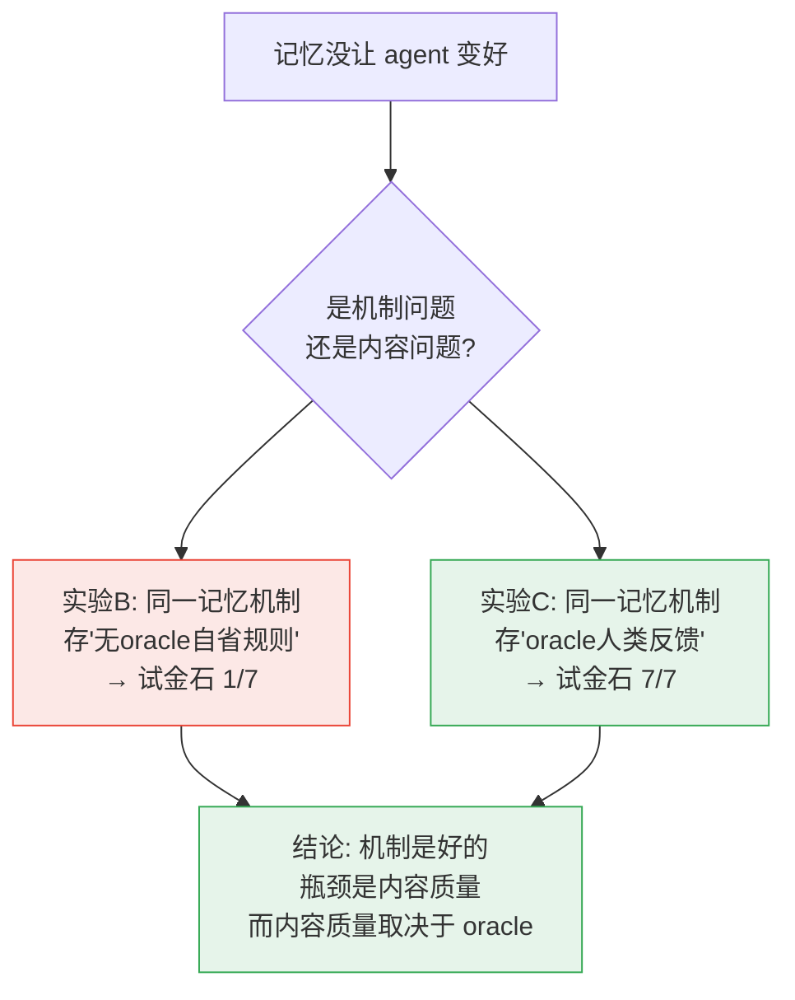

# 记忆能让 AI Agent 越跑越好吗？——一次关于 AgentCore Memory 的诚实实验

> 复现自 AWS 博客《[Self-learning evolvable agents for cultural tourism info extraction with AgentCore](https://aws.amazon.com/cn/blogs/china/self-learning-evolvable-agents-for-cultural-tourism-info-extraction-with-agentcore/)》，任务换成**中文工业技术文档抽取**（低温液氮储罐技术要求）。本文是 V1/V2 两轮实验的最终综合版，替代此前的技术报告作为结论。区域 us-west-2。

## 一句话结论（先给答案）

给 agent 加长期记忆，它会不会"越用越聪明"？

**会，但有一个大多数人会忽略的前提：回路里必须有一个 oracle——一个能告诉 agent "对不对 / 该抽什么"的外部权威（标准答案、人类反馈、或带评分标准的裁判）。**

- 记忆机制本身是好的——把累积的经验注入下一次运行，确实能生效。
- 但记忆能不能变好，取决于你往里存什么。**让模型对着自己的产出空想、蒸馏成"经验规则"，产出的是垃圾，甚至帮倒忙。**
- 一旦你把 oracle 质量的反馈存进记忆，同一套机制立刻兑现巨大增益。

**记忆是好的载体，不是好的老师。** 这篇文章讲我们怎么一步步逼出这个结论——包括中途一个把我们骗了的 bug。

---

## 1. 我们在测什么

任务很简单：从一份 13 页的中文工业技术文档里，抽出结构化条目 `设备主体 / 设备部件 / 指标名称 / 指标特征 / 原文`，和人工标注的标准答案（Ground Truth，123 条）对比打分。

我们把实验设计成**只有一个变量：记忆开 / 关**。其余（模型、提示词、单次调用方式）两组完全一样。这样"记忆到底有没有用"才能干净地回答。


**三个衡量指标**，贯穿全文：
- **覆盖率（召回）**：抽出的条目覆盖了多少标准答案。
- **精确率**：抽出的条目里有多少是对的（惩罚"乱抽/过度拆分"）。
- **F1**：前两者的调和平均，综合看。

还有一个诊断指标后面会反复用到——**recall_fail（真召回失败数）**：标准答案里某条，和我们抽出的**任何**条目都毫无重叠，即"根本没抽出来"。它和"抽了但对不齐"是两回事，区分它们是整个故事的关键。

---

## 2. 第一版结果骗了我们

第一轮实验（V1）看起来非常鼓舞人心：带记忆的模式覆盖率一路走高，0.82 → 0.87，像教科书里的"自学习曲线"。我们差点就此收工。

**幸好多问了一句：这个尺子准吗？** 结果发现两个问题，足以推翻结论：

1. **评分有 bug。** 裁判分块打分时，缺了一个全局约束，导致**同一个抽取项可以被重复算去匹配多条标准答案**。后果是覆盖率被系统性高估。这个 bug 有铁证：某次运行只抽了 91 条，却报"匹配上 94 条标准答案"——**94 > 91 在一对一对齐下根本不可能**。

2. **对比不干净。** 那个"表现好"的记忆模式，其实偷偷用了**另一个更强的抽取器**（能抽更完整），而且**没有冷启动**（复用了之前跑积累的记忆）。所以它领先的时候，记忆甚至还是空的——领先跟记忆无关。

**修好评分、拉平所有变量、冷启动重跑之后，记忆的增益消失了。** 带记忆和不带记忆打平，甚至略低。

> **教训一：先怀疑自己的尺子。** 一个乐观的结果，如果来自没校准的度量，比没有结果更危险。

---

## 3. 为什么没用？——不轻易下"记忆无效"的结论

"打平"很容易让人写下"记忆没用"就收场。但这是偷懒。我们改成问：**到底漏了什么？漏的东西有规律吗？**

于是把所有漏抽的标准答案捞出来，按前面说的 recall_fail 分类。发现一个清晰的规律：**漏掉的大部分（约 3/4）是"真召回失败"——根本没抽出来**。而这些没抽出来的东西高度同质：

```
「外观颜色及喷涂 LOGO 须与甲方确认」
「真空度测量报告」/「真空度测量要求」
「外部油漆等工序」
「承制单位细化设计…提供全套地脚螺栓」
```

它们**都不是"设备+部件+指标+数值"这种定量三元组**，而是散文式、流程式、待确认类的要求。

**根因找到了**：我们的抽取 schema 天生面向定量指标。模型看到一句没有数值、只有要求的话，就默认"这不是一条指标"，直接跳过。**漏的不是模型能力，是它以为这些不该抽。**

> **教训二："没效果"往往不是终点，而是一个还没做的错误分析。** 不做归因就下结论，可能把"提示词/任务定义问题"误判成"方法无效"。

---

## 4. 三个实验，锁定因果

有了诊断，我们做了三个环环相扣的实验，最终把因果彻底钉死。

### 实验 A：把漏项当线索，改提示词 —— 有效

不改 schema，只在提示词里显式加一句：**"非定量要求（定性/流程/报告/待确认类）也要抽，把要求类型放进『指标名称』、要求内容放进『指标特征』"**，并附上刚才那几个真实漏项当示例。

效果立竿见影：

| | 覆盖率 | recall_fail | 散文类抽到几个 |
|---|---|---|---|
| 基线（无此提示） | 0.642 | **27** | 1 / 7 |
| **加了提示词** | **0.715** | **1** | **7 / 7** |

真召回失败从 27 塌到 1，之前漏的散文类全抓到了。**证明这是提示词/任务定义问题，改得动。**

**但是**——这个改进来自"拿标准答案做错误分析"。这里就用到了 oracle（标准答案）。于是真正的问题浮现：

> **没有标准答案的记忆场景，能自己学到这条教训吗？**

### 实验 B：让记忆"自省" —— 学不到

这正是我们最初的记忆设计：抽完让模型**反思自己的输出**、蒸馏成"可复用规则"，存进记忆、下轮注入。全程**没有标准答案**。

结果：跑了几轮、沉淀了十几条规则，那根"试金石"（散文类抓到几个）**纹丝不动，钉死在 1 / 7**。

模型学不到"该抽散文类"——因为它只看自己的产出，没有任何外部信号告诉它"这些也算数"。它能蒸馏出的只是些通用文风规则（"复合指标要拆分"），碰不到真问题，甚至因为过度强调"拆分"而**帮倒忙**（把句子切碎、拉低精确率）。

### 实验 C：把教训当"人类反馈"写进记忆 —— 有效

最后一步，也是最关键的一步。AgentCore Memory 支持直接写入记忆记录。我们**把实验 A 里那条来自错误分析的教训，当作"人类专家反馈"直接写进记忆**，然后用**基线提示词**（不含任何强化）跑一次——让这条教训**只从记忆注入，不进提示词**。

| | 覆盖率 | 精确率 | F1 | recall_fail | 散文类 |
|---|---|---|---|---|---|
| 基线 | 0.642 | – | – | 27 | 1 / 7 |
| **人类反馈写进记忆** | **0.813** | 0.813 | **0.813** | **2** | **7 / 7** |

**目前最好的一次。** 教训通过记忆注入，拿到了和写进提示词一样、甚至更漂亮的效果。

### 决定性对照

把实验 B 和 C 并排看——**注入路径完全相同（都是记忆），唯一的差别是内容质量**：

| 记忆里存的内容 | 来源 | 散文类试金石 |
|---|---|---|
| 模型对自己产出的自省规则 | 无 oracle | **1 / 7**（学不到）|
| 来自错误分析的人类反馈 | 有 oracle | **7 / 7**（全学会）|

**因果就此锁定：记忆的注入机制一直是好的。之前记忆没用，坏的是"无 oracle 自省"产出的内容是垃圾。**



---

## 5. 记忆使用的最佳实践

这就是我们要找的东西。综合三个实验：

**核心原则：记忆是载体，不是老师。它负责"捕获并复用"反馈，但反馈本身必须由 oracle 提供。**

具体到工程实践：

1. **先确保回路里有 oracle。** 没有"对错/目标"的外部信号，记忆再多也只在原地打转。oracle 不必是完整标准答案——**人类的一次纠正、少量标注样本、一个带评分标准的裁判**都行。（这也解释了 AWS 博客那套 self-learning 为什么有效：它吃的是**人类/下游反馈**，不是模型的自我空想。）

2. **记忆里存"具体的、对照答案/原文的批评"，不要存"抽象文风规则"。** "你漏了真空度测量这一段"是有用的；"复合指标要拆分"是空洞的，还会诱发过度拆分反噬。

3. **oracle 可以只用一次。** 我们用标准答案做了**一次**错误分析，把结论沉淀成一条可复用记忆——之后就能无标注地跑。用少量监督撬动长期收益，是最划算的用法。

4. **区分你想学的是哪类教训：**
   - **任务规格类**（该抽什么、什么粒度、什么算一条）——**必须有 oracle**，从"文档+自己的输出"推不出来。
   - **源覆盖 / 一致性类**（文档提到 X 你没抽、重复了、格式错了）——对照原文即可，**没 oracle 也能学一点**（我们另一个"对照原文自我批评"的实验，无标准答案也救回了一部分漏项，只是天花板低得多）。

---

## 6. 与原博客和方法学的关系

- **任务映射**：博客做文旅信息抽取的多 agent 自进化，我们把它收敛成**单变量的"记忆开/关"消融**，聚焦回答"记忆到底有没有用、为什么"。
- **承载**：用 **AgentCore Harness**（配置驱动的托管 agent，声明式，无需容器）+ **AgentCore Memory**（事件存储 + 可选的托管提炼策略）。
- **对应 LangChain 的 [Loop Engineering](https://www.langchain.com/blog/the-art-of-loop-engineering) 框架**：本项目正是其 **Level 4「爬山循环」**——每次运行 → 反思 → 改写辅助配置（记忆）→ 下轮更好。我们的发现给这个框架补了一个前提条件：**爬山需要一个能指明"上坡方向"的 oracle，否则只是在原地随机游走。**

---

## 7. 诚实的局限

这些直接影响结论强度，必须写明：

- **单文档、小样本**：只在一份文档上、少数几次运行。存在很大的 run 间方差（同一设置覆盖率能在 0.55–0.81 间跳）。因此**方向可信、幅度不宜强断**，未做统计显著性主张。
- **未测泛化**：全部在同一篇文档上，没有"训练文档集 → 未见文档"的留出评估。所以本文只谈"记忆能不能捕获并复用反馈"，**不谈跨文档泛化**。
- **裁判未经人工校准**：标准答案与 LLM 裁判都没做人工混淆矩阵；有一处测量口径背离（token 重叠启发式 vs 裁判一对一对齐），说明裁判覆盖率可能**低估**了真实召回改善。
- 严格验证需要：多文档盲测 + 多 seed + 置信区间 + 人工校准。这是明确的未来工作。

---

## 附录 A：AgentCore Memory 关键概念

| 概念 | 说明 |
|---|---|
| **event（事件）** | 最底层。`create_event` / `list_events` 直接读写，**精确、即时**。按 `actorId` + `sessionId` 分区。 |
| **strategy（策略）** | 托管的异步提炼（SEMANTIC / EPISODIC / …），把事件加工成 record。 |
| **memory record（记录）** | 策略产出，按 `namespace` 做语义 topK 检索，**异步、非即时**。 |
| **两种用法** | 本项目 custom 路径把 Memory 当**事件存储**（list_events 精确召回）；episodic 路径用**托管策略**产出记录。 |

> 本文实验为求"精确、即时、可控"，记忆注入/沉淀由外层确定性代码编排，AgentCore Memory 仅当事件存储；抽取/反思/评分都是 Agent（Claude）经 `invoke_harness` 完成。

## 附录 B：复现

```bash
pip install --break-system-packages -r requirements.txt
cd memory-loop
# 单变量消融（记忆开/关基线）
python3 scripts/run_experiments_v2.py
# 提示词优化验证（实验A）
python3 scripts/run_experiments_opt2.py
# 人类反馈写进记忆（实验C，本文核心）
python3 scripts/run_experiment_human_feedback.py
# 召回错误分析（诊断，无需 LLM）
python3 scripts/analyze_recall.py runs_v2_hf.db mem
```

> 机密语料 `input/`、含抽取内容的 `runs*.db`、含账号信息的 `config.local.json` 均在 `.gitignore`，不随仓库发布。

## 附录 C：数据全表（同一把尺）

| 回路 | 教训来源 | 教训放哪 | 覆盖率 | 精确率 | F1 | recall_fail | 散文试金石 |
|---|---|---|---|---|---|---|---|
| 基线（无记忆） | — | — | 0.642 | – | – | 27 | 1/7 |
| 自省记忆 | 模型自省（无 oracle） | 记忆 | 0.561 | – | – | 18* | **1/7** |
| 提示词优化 | GT 错误分析 | 提示词 | 0.715 | 0.698 | 0.707 | 1 | 7/7 |
| **人类反馈记忆** | GT 错误分析（当反馈） | **记忆** | **0.813** | 0.813 | **0.813** | 2 | **7/7** |

（*自省记忆 recall_fail=18 低于基线 27 是"过度拆分"的噪声——切碎的细条碰巧 token 重叠上；但散文试金石 1/7 证明它真正该学的一条都没学会。所以看试金石，别看这个 18。）

## 引用

- AWS 博客：[Self-learning evolvable agents … with AgentCore](https://aws.amazon.com/cn/blogs/china/self-learning-evolvable-agents-for-cultural-tourism-info-extraction-with-agentcore/)
- LangChain：[The Art of Loop Engineering](https://www.langchain.com/blog/the-art-of-loop-engineering)
- AgentCore CLI（`@aws/agentcore`）、Amazon Bedrock、json-repair
